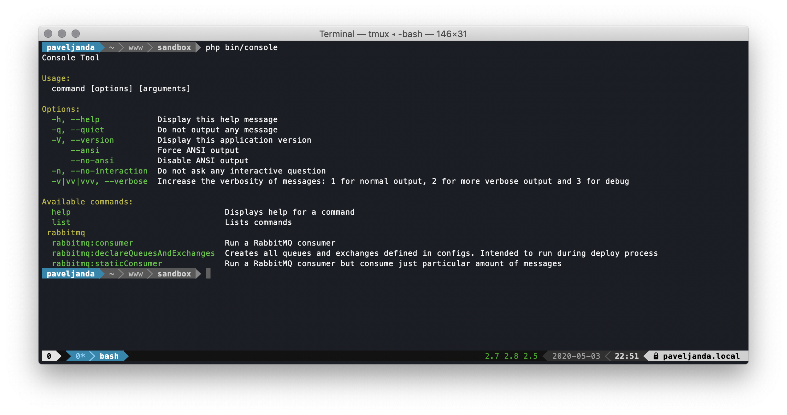
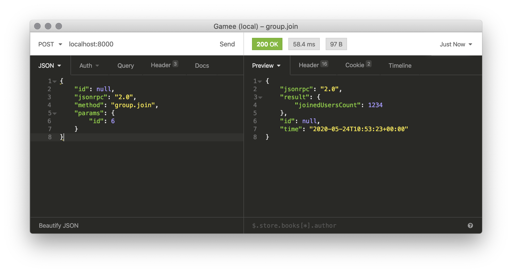
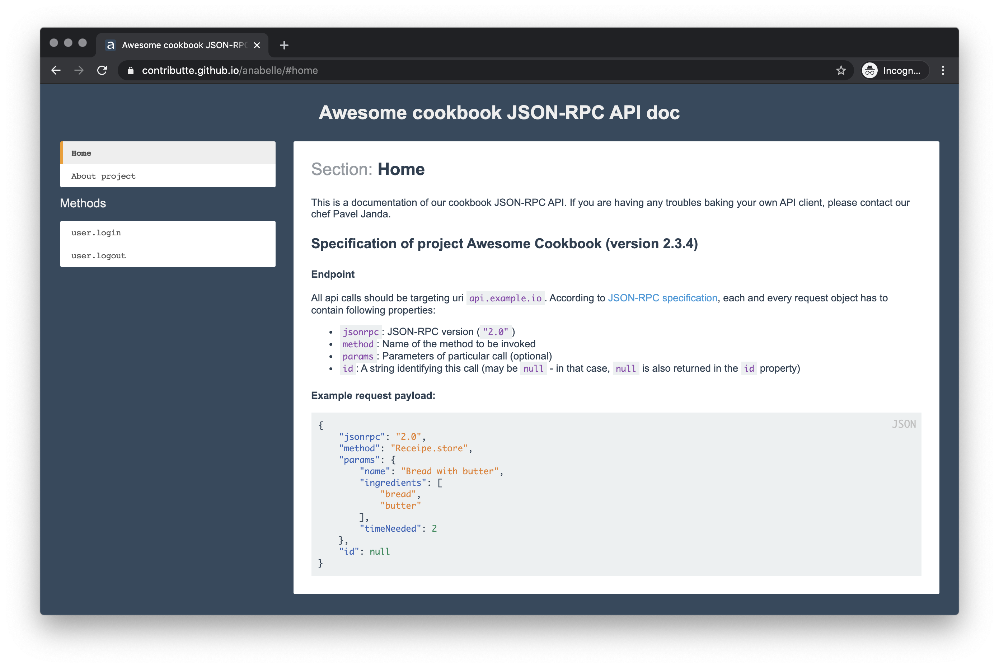

# Contributte: akvizice Gamee balíčků

Jako autor Ublaboo balíčků jsem si před časem s Milanem plácl na přesunutí většiny knihoven do Contributte. Navzájem si tak "organizace" pomohou a Contributte se posunete zase o kousek dál směrem k robustnímu celku, kterému lidé věří a mohou se na něj spolehnout. Krom aktuálně nejpoužívanějšího datagridu získala Contributte ještě další knihovničky s desítkami tisíc stažení.

## O pár měsíců a akvizicí později...

V rámci svého full-time jobu v Gamee (gamee.com) jsme vyvinuli super vendory, které si zaslouží své místo na výsluní. A neboť bych chtěl v Contributte repozitářů víc a víc, rozhodl jsem se některé balíčky z Gamee opět přesunout do Contributte. Pojďme se na ně podívat.

### gamee/nette-rabbitmq -> contributte/rabbitmq

Odkaz na GitHub zde: [contributte/rabbitmq](https://github.com/contributte/rabbitmq)

Knihovna používá pro připojení k RabbitMQ výkonný vendor [bunny/bunny](https://github.com/jakubkulhan/bunny). Pomocí konfiguračního souboru si jednoduše nadefinuji fronty/exchanges, producery a consumery a o všechno související s API RabbitMQ se postará knihovna sama. Potřebné učební materiály najdele v [README](https://github.com/contributte/rabbitmq/blob/master/.docs/README.md#installation).

### gamee/php-jsonrpc -> contributte/jsonrpc

Odkaz na GitHub zde: [contributte/rabbitmq](https://github.com/contributte/jsonrpc)

Jaké komunikační schéma používáte, pokud se pouštíte do implementace API? Nejčastější bude asi výskyt REASTových API nebo jejich ohnutých podob. Před pár lety jsem napsal jedno API v [JSON-RPC](https://www.jsonrpc.org/specification). Jde víceméně o to, že každý request obsahuje property `method` a `id`. Metoda určuje, co chci po API, aby udělalo (`logIn`, `user.authentication.register` apod.). Nullable ID je unikátní per request - to mi zaručí správnou funkcionalitu při volání asynchronního API (pošlu několik requestů na server, ale vrátit se mohou klidně v úplně jiném pořadí, tak je vhodné každý request nějakým způsobem identifikovat).

Integrace do Nette přináší jednoduchost mapování metod na třídy v aplikační logice ale i automatickou validaci JSON-RPC schématu a příchozího requestu. [JSON schema](https://json-schema.org/) používáme právě pro validaci vstupních dat. A opět - vše jsme za vás již implementovali. README knihovny je zatím ve výstavbě. Snad brzdy se dočkáme pořádného tutorialu a dema v `planette/playground`. :)

## ublaboo/anabelle -> contributte/anabelle

Projekt Anabelle jsem pořádně zatím nikde nezmiňoval, tak to napravím zde, protože úzce souvisí s výše zmíneným JSON-RPC.

JSON-RPC jsem si oblíbil a vyskytuje se tak na všech projektech, na kterých (spolu)pracuji. U každého API by měla být samozřejmostí přítomnost API dokumentace. Apiary či Swagger je fajn, ale jejich design je svázaný s REST API. Tak jsem jednoho krásného večera šel a rozšířil Markdown o makra include a pár dalších, obarvil a hle, je na světě .... rozšířený obarvený Markdown. :D Můj zatím nejoblíbenější API dokumentační tool! Pomocí Anabelle dokumentuji JSON-RPC, REST, dokonce v tom píši i své poznámky naprosto nesouvisející s programováním.

GitHub: [contributte/anabelle](https://github.com/contributte/anabelle)
Demo: https://examples.contributte.org/packages/anabelle
Playground: https://github.com/planette/playground/tree/master/contributte-anabelle
